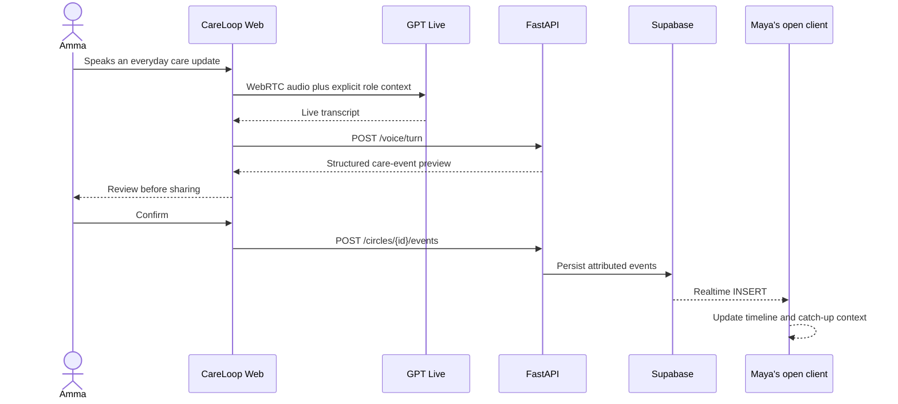
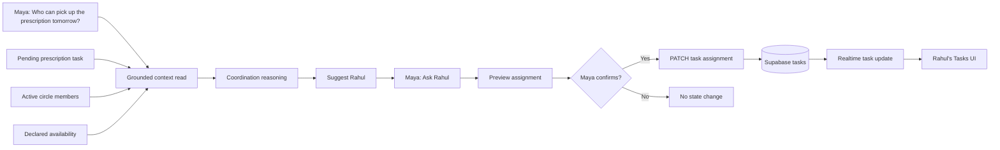
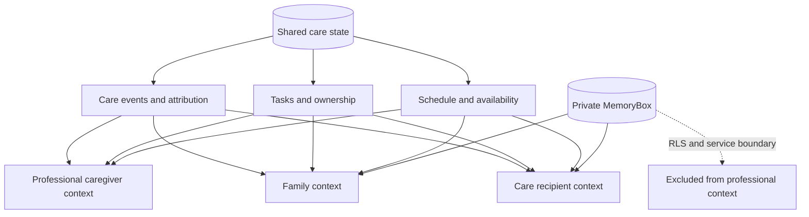
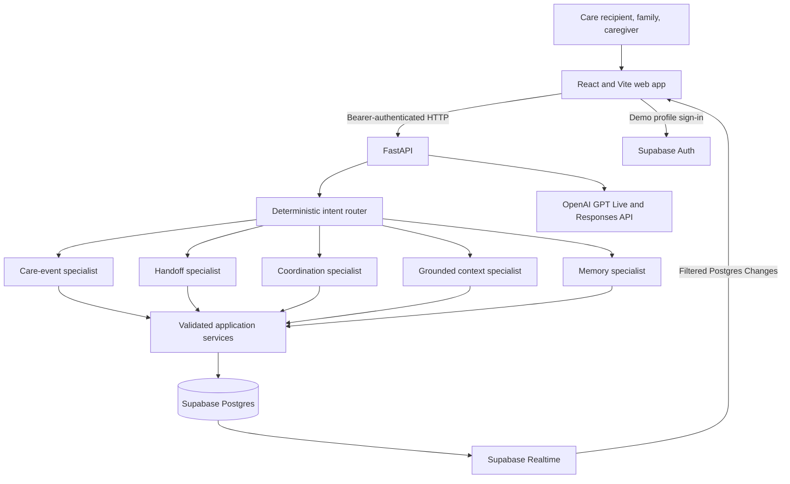
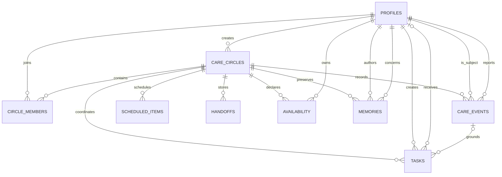

<h1 align="center">CareLoop</h1>

<h3 align="center">Care, understood together.</h3>

<p align="center">
  <strong>A voice-native shared care coordination layer for families and professional caregivers.</strong>
</p>

<p align="center">
  CareLoop turns everyday conversation into shared context, coordinated action, and real-time family care.
</p>

<p align="center">
  
  
  
  
</p>

<p align="center">
  
</p>

<p align="center"><em>One calm place for the Care Circle to see what is happening, who is helping, and what comes next.</em></p>

<p align="center">
  <strong>Voice → Understanding → Shared context → Coordination → Realtime action</strong>
</p>

<p align="center">
  <code></code> · <a href="https://drive.google.com/file/d/1oj9YIp_1nmelZRLYtAxHtW86W8iE4LFV/view?usp=sharing"><strong>▶ Watch the demo video</strong></a>
</p>

> [!IMPORTANT]
> CareLoop coordinates and summarizes. It does not diagnose, prescribe, or alter medication.

## Overview

CareLoop is a shared conversational layer for a care circle. A care recipient can speak naturally; CareLoop prepares a reviewable structured update; family members can catch up from persisted state; coordination can reason across tasks and declared availability; confirmed assignments reach another open client through Supabase Realtime; and a professional caregiver receives only the context appropriate to that role.

It is not a chatbot wrapped around a form. Conversation is the entry point to durable, attributable application state.

## Problem statement

Family care is usually scattered across phone calls, messages, visits, memory, and several people carrying different pieces of the story. Recording another note does not solve the coordination problem. The care circle still needs to know:

- What changed?
- What needs attention?
- Who is available to help?
- Has someone taken responsibility?
- Which context is appropriate for each role?

Generic chatbots lose state between conversations. Generic task managers lose the human context behind the work. CareLoop joins the two around one persistent, shared care state.

## Solution

CareLoop converts natural conversation into a safe, visible coordination loop:

1. Someone speaks or types naturally.
2. CareLoop routes the request and prepares structured output.
3. The person reviews any generated write before confirming it.
4. Confirmed care events, tasks, or memories are persisted.
5. Family members ask grounded questions over events, tasks, schedules, members, and availability.
6. Coordination suggestions become real assignments only after confirmation.
7. Supabase Realtime propagates event and task changes to active clients.
8. Role-aware UI, service checks, and RLS keep private family memories out of professional caregiver context.

> CareLoop is not a voice form. It is a shared conversational layer for a care circle.

### The demo story

| Person                       | Interaction                                           | What CareLoop does                                                                           |
| ---------------------------- | ----------------------------------------------------- | -------------------------------------------------------------------------------------------- |
| Amma · care recipient        | “I didn't sleep well and I didn't eat much at lunch.” | Extracts separate sleep and meal events, preserving Amma as both subject and reporter        |
| Maya · daughter              | “Catch me up.”                                        | Synthesizes recent events, open work, completed work, and upcoming care from persisted state |
| Maya                         | “Who can pick up the prescription tomorrow?”          | Compares the pending task with member availability and identifies Rahul                      |
| Maya                         | “Ask Rahul.”                                          | Previews the assignment, waits for confirmation, then updates the real task                  |
| Rahul · son                  | Keeps his Tasks view open                             | Receives the assignment through a filtered Realtime subscription without refreshing          |
| Anu · professional caregiver | “What should I know before my visit?”                 | Receives relevant events, scheduled care, and assigned work—never private MemoryBox data     |
| Amma and family              | “My first job — 1978.”                                | Can review and preserve the story in the family-only MemoryBox                               |

## The engineering story

These three flows are the heart of CareLoop: a spoken update becomes shared state, state becomes coordinated responsibility, and each role sees a deliberately bounded view.

### 1. CareLoop Heartbeat

One natural sentence becomes reviewed, structured state visible to another member of the care circle.



The schema keeps `subject_id` separate from `reported_by`. Maya can report something about Amma without becoming the subject of that event, and both identities remain available for attribution.

### 2. Coordination Flow

CareLoop operates over real application state—not generated text alone.



Availability is a declared window, not a guaranteed commitment. The suggestion remains separate from the confirmed mutation.

### 3. Role-aware context boundary

The care circle shares operational state, while private family memory remains intentionally separate.



The professional caregiver experience omits the MemoryBox route, the API rejects caregiver memory access, context tools never query memories, and Supabase RLS returns no MemoryBox rows to that role.

## Features

- **Voice-first updates:** browser microphone input through GPT Live, with a typed alternative and explicit application-provided identity context.
- **Structured care understanding:** OpenAI structured outputs—or deterministic demo extraction—produce typed events with provenance and confidence.
- **Catch Me Up:** grounded handoff synthesis over the last 48 hours of care events plus tasks and upcoming schedule items.
- **Coordination:** task, member, and availability reads support assignee suggestions, followed by reviewable assignment or completion actions.
- **Realtime care circle:** filtered Postgres Changes subscriptions update care events, tasks, and family memories in active clients.
- **Role-aware experiences:** separate care-recipient, family, and professional caregiver homes and voice prompts.
- **MemoryBox:** structured family stories with an intentional caregiver exclusion at UI, API, and database levels.
- **English and Malayalam-aware voice routing:** preferred language travels with explicit user context; tested native Malayalam patterns cover care updates, catch-up, and coordination.
- **Gentle wellbeing check-ins:** subjective sharing only—never a clinical score or assessment.

## High-level system architecture

The browser owns presentation, authenticated demo sessions, and scoped Realtime subscriptions. FastAPI owns identity verification, membership checks, bounded agent orchestration, provider credentials, and every application mutation.



### Data model

The versioned schema has nine public tables. Circle membership is the common access boundary; compound foreign keys keep referenced subjects, reporters, assignees, authors, and availability owners inside the same circle.



## Engineering highlights

| Decision                                 | What it means in CareLoop                                                                                                    |
| ---------------------------------------- | ---------------------------------------------------------------------------------------------------------------------------- |
| Structured state, not chatbot-only state | Model output is parsed into typed schemas; confirmed results become care events, tasks, or memories                          |
| Grounded reads                           | Catch-up and context answers use named service reads over persisted CareLoop data and return source labels/timestamps        |
| Deterministic identity                   | User, circle, speaker, subject, role, relationship, and preferred language come from application context—not voice inference |
| Review before mutation                   | Care updates, memory saves, assignments, and completions are previewed before write APIs are called                          |
| Layered access control                   | Bearer-token verification and service membership checks complement database RLS and membership foreign keys                  |
| Role-scoped memory                       | Caregivers are excluded from MemoryBox in navigation, service authorization, context retrieval, and RLS                      |
| Reproducible demo state                  | Fixed synthetic identities and records make the core coordination scenario resettable and verifiable                         |
| Conservative clinical boundary           | Unsafe diagnosis, prescribing, dose-change, and medication-stop requests are rejected                                        |

## Tech stack

| Layer                   | Technology used                                                                       |
| ----------------------- | ------------------------------------------------------------------------------------- |
| Web                     | React 18, TypeScript 5.7, Vite 6, React Router 7                                      |
| Interaction and visuals | Framer Motion 13, Lucide React, repository-owned CSS design tokens                    |
| API                     | Python 3.11+, FastAPI, Pydantic Settings, Uvicorn, HTTPX                              |
| AI — live voice         | OpenAI `gpt-live-1` over WebRTC for speech input, speech output, and live transcripts |
| AI — structured flows   | OpenAI Responses API with `gpt-5.6-luna` for care-event extraction, handoffs, grounded context synthesis, coordination, and memory extraction |
| Data                    | Supabase Postgres, Auth, Row Level Security, Realtime                                 |
| Tooling                 | pnpm 9 workspace, TypeScript, Vitest, Pytest, Ruff, Supabase CLI                      |
| Packaging               | Dockerfiles for web/API and a local Docker Compose definition                         |

## Codex / OpenAI usage

### AI inside CareLoop

OpenAI is behind the FastAPI boundary. The model identifiers are literal values in the current implementation; [`.env.example`](.env.example) configures the API key but does not override either model.

| Purpose | Provider | Model |
| --- | --- | --- |
| Realtime voice, speech input/output, and live transcript | OpenAI | `gpt-live-1` |
| Care-event extraction | OpenAI | `gpt-5.6-luna` |
| Handoff summary | OpenAI | `gpt-5.6-luna` |
| Coordination suggestions | OpenAI | `gpt-5.6-luna` |
| Memory extraction | OpenAI | `gpt-5.6-luna` |
| Multi-source context synthesis | OpenAI | `gpt-5.6-luna` |
| Task, schedule, and meal reads; intent routing | CareLoop deterministic services | No model required |

`gpt-live-1` handles the live audio session and transcripts; CareLoop does not configure separate STT or TTS model IDs. `gpt-5.6-luna` serves the five Responses API structured-output flows listed above. Context synthesis receives only authorized care records and returns source attribution; ordinary task, schedule, and meal reads remain deterministic. The deterministic intent router and named specialists constrain what a model can request, and models receive no arbitrary SQL or code-execution capability.

CareLoop also remains demonstrable without provider credentials: deterministic fallbacks cover the fixed voice update, grounded handoff, prescription coordination, and memory flow.

### AI-assisted development

- **Codex**
- **Antigravity**
- **OpenCode**

### Human direction & integration

- **Adithya A** — product direction, architecture decisions, decomposition, agent ownership, integration, merges, conflict resolution, review, testing, demo design, and final validation.

AI accelerated implementation across isolated worktrees and feature branches. Architecture, product decisions, integration, and final engineering ownership remained human-directed.

## Screenshots

Follow the CareLoop story from Amma's voice-first check-in to shared context, coordinated family action, and Anu's bounded caregiver view.

<table>
  <tr>
    <td width="50%" align="center"><strong>Patient Home</strong></td>
    <td width="50%" align="center"><strong>Voice Update</strong></td>
  </tr>
  <tr>
    <td></td>
    <td></td>
  </tr>
  <tr>
    <td align="center"><strong>Timeline</strong></td>
    <td align="center"><strong>MemoryBox</strong></td>
  </tr>
  <tr>
    <td></td>
    <td></td>
  </tr>
  <tr>
    <td align="center"><strong>Care Circle</strong></td>
    <td align="center"><strong>Catch Me Up</strong></td>
  </tr>
  <tr>
    <td></td>
    <td></td>
  </tr>
  <tr>
    <td align="center"><strong>Coordination</strong></td>
    <td align="center"><strong>Care Schedule</strong></td>
  </tr>
  <tr>
    <td></td>
    <td></td>
  </tr>
  <tr>
    <td align="center"><strong>Rahul's View</strong></td>
    <td align="center"><strong>Caregiver View</strong></td>
  </tr>
  <tr>
    <td></td>
    <td></td>
  </tr>
  <tr>
    <td colspan="2" align="center"><strong>Visit Actions</strong></td>
  </tr>
  <tr>
    <td colspan="2"></td>
  </tr>
</table>

## Demo

- **Live demo:** `[Add Live Demo URL]`
- **Demo / pitch video:** [Watch CareLoop in action](https://drive.google.com/file/d/1oj9YIp_1nmelZRLYtAxHtW86W8iE4LFV/view?usp=sharing)

For the judging flow, watch for:

**Voice → structured state → Catch Me Up → availability reasoning → confirmed task assignment → Realtime update in Rahul's second client**

The seeded roles are Amma (care recipient), Maya (daughter/coordinator), Rahul (son/family member), and Anu (professional caregiver). All demo data and credentials are synthetic.

## How to run locally

### Prerequisites

- Node.js 20 or newer
- pnpm 9 (`packageManager` is pinned to `pnpm@9.15.0`)
- Python 3.11 or newer
- Docker only when running the local Supabase stack
- Your own Supabase project credentials for persistent Auth/Postgres/Realtime mode
- An OpenAI API key for GPT Live and model-backed extraction; optional for deterministic demo mode

The Supabase CLI is pinned in the repository and installed by `pnpm install`; a global install is not required.

### Clone and install

```bash
git clone https://github.com/adithya-a-labs/careloop.git
cd careloop
pnpm install
python -m venv apps/api/.venv
```

Activate the virtual environment and install the API:

```powershell
# Windows PowerShell
.\apps\api\.venv\Scripts\Activate.ps1
python -m pip install -e "apps/api[dev]"
Copy-Item .env.example .env
```

```bash
# macOS or Linux
source apps/api/.venv/bin/activate
python -m pip install -e "apps/api[dev]"
cp .env.example .env
```

### Fastest path: deterministic demo mode

Leave `DEMO_MODE=true` and the Supabase/OpenAI credentials blank in `.env`, then run:

```bash
pnpm dev
```

- Web: <http://localhost:5174>
- API docs: <http://localhost:8000/docs>

This mode uses the in-memory synthetic care circle and fixed extraction fallbacks. It is useful for UI exploration, API tests, and the main product story without external credentials. Persistent cross-client Realtime requires the Supabase path below.

## Bring Your Own Supabase

> [!TIP]
> CareLoop does **not** require the original developer's Supabase credentials. Provision a Supabase project you own from the repository's migrations and synthetic seed.

The reproducibility contract is deliberately version controlled:

1. [`supabase/migrations/`](supabase/migrations/) — authoritative schema, constraints, indexes, functions, grants, RLS, and Realtime publication setup.
2. [`supabase/seed.sql`](supabase/seed.sql) — deterministic Amma, Maya, Rahul, and Anu identities plus care history, the unassigned prescription task, Rahul's availability, an upcoming Anu visit, and private family memories.
3. [`scripts/setup-supabase.ts`](scripts/setup-supabase.ts) — guarded automation that applies migrations and seed data to the selected project.
4. [`scripts/verify-supabase.ts`](scripts/verify-supabase.ts) — executable proof of schema, RLS, Realtime, demo state, shared task access, and Anu's MemoryBox exclusion.
5. [`docs/SUPABASE_SETUP.md`](docs/SUPABASE_SETUP.md) — the complete hosted and local setup guide.

### Configure your project

Fill the root `.env` with values from your own Supabase project. Do not paste secret values into issues, logs, or chat.

| Variable                        | Used by                    | Purpose                                     |
| ------------------------------- | -------------------------- | ------------------------------------------- |
| `SUPABASE_URL`                  | API and scripts            | Target project URL                          |
| `SUPABASE_PUBLISHABLE_KEY`      | Setup/verification scripts | Browser-safe project key                    |
| `SUPABASE_SECRET_KEY`           | API and setup tools only   | Privileged server-side access               |
| `SUPABASE_PROJECT_REF`          | Setup tools                | Hosted project reference                    |
| `SUPABASE_DB_PASSWORD`          | Supabase CLI               | Migration connection                        |
| `SUPABASE_ACCESS_TOKEN`         | Supabase CLI               | CLI authentication                          |
| `VITE_SUPABASE_URL`             | Browser                    | Same target project URL                     |
| `VITE_SUPABASE_PUBLISHABLE_KEY` | Browser                    | Browser-safe project key                    |
| `OPENAI_API_KEY`                | API only                   | GPT Live and Responses API                  |
| `DEMO_MODE`                     | API                        | Set to `false` for persistent Supabase mode |

Legacy `ANON_KEY` and `SERVICE_ROLE_KEY` aliases in [`.env.example`](.env.example) are supported. Never place a secret or service-role key in a `VITE_` variable.

For a fresh hosted development or judging project:

```bash
pnpm setup:supabase
pnpm verify:supabase
pnpm dev
```

`setup:supabase` validates the project identity and synthetic accounts, runs `supabase db push --linked --include-seed`, and invokes the same verification suite. It refuses known unsafe mismatches instead of overwriting them.

To restore the persistent demo circle to its exact synthetic opening state later, run `pnpm demo:reset`. Use `pnpm demo:seed` when you want deterministic upserts without deleting interactions created inside that demo circle.

For a local Supabase stack, start Docker and run:

```bash
pnpm exec supabase start
# Copy the local URL and keys reported by Supabase into .env.
pnpm setup:supabase
pnpm verify:supabase
pnpm dev
```

Local setup uses `supabase db reset --local`; use it only for the disposable local stack. See the [BYO Supabase guide](docs/SUPABASE_SETUP.md) for the full environment map and troubleshooting.

### AI-agent-friendly setup

Human setup is fully supported. An AI coding agent with a Supabase connector can also provision a user-owned project by reading, in order:

1. [`AGENTS.md`](AGENTS.md)
2. [`.env.example`](.env.example)
3. [`docs/SUPABASE_SETUP.md`](docs/SUPABASE_SETUP.md)
4. [`supabase/migrations/`](supabase/migrations/)
5. [`supabase/seed.sql`](supabase/seed.sql)

The agent should connect only to the user's project, apply migrations in order, seed the synthetic demo, and finish with `pnpm verify:supabase`. Repository migrations remain authoritative; the agent should not invent or rename schema.

## Verification

```bash
pnpm typecheck
pnpm build
pnpm test
```

Supabase-specific checks:

```bash
pnpm typecheck:supabase
pnpm test:supabase-tools
pnpm verify:supabase  # requires a configured target project
```

The API suite covers contracts, confirmation behavior, safety rejection, role boundaries, provider adapters, the voice-to-event flow, coordination, grounded reads, and Malayalam intent routing.

## Security and privacy

- Browser code receives only the Supabase project URL and publishable/anon key.
- Supabase secret/service-role credentials and the OpenAI key stay in `apps/api` and server-side tools.
- Real mode verifies the bearer token, derives the actor from Supabase Auth, and checks active circle membership on service operations.
- RLS is enabled across all nine public tables; circle-scoped foreign keys prevent cross-circle identity references.
- Direct care-event and task inserts bind `reported_by` and `created_by` to `auth.uid()`.
- Voice sessions receive explicit application identity and role context; identity is never inferred from a voice.
- Generated mutations are previewed and require confirmation.
- MemoryBox access is restricted to the care recipient and family members.
- Setup and verification scripts redact configured secret values from failure messages.

CareLoop is a hackathon prototype, not a diagnostic medical system. Production use would require a dedicated security, privacy, operations, and regulatory review.

## Repository structure

```text
careloop/
├── apps/
│   ├── web/                 # React role-aware experience and Realtime clients
│   └── api/                 # FastAPI routes, services, bounded agents, voice sessions
├── packages/
│   ├── design-system/       # Warm tokens and reusable React primitives
│   └── shared/              # Stable shared types and safety copy
├── supabase/
│   ├── migrations/          # Schema, RLS, grants, indexes, Realtime
│   └── seed.sql             # Deterministic synthetic care circle
├── scripts/                 # Setup, verification, seed, reset, and smoke tools
├── docs/                    # Architecture, contracts, safety, testing, setup
├── output/playwright/       # Responsive UI validation captures
├── AGENTS.md                # Repository operating guide for coding agents
├── DESIGN.md                # Canonical product and interface language
└── package.json             # Workspace commands
```

## What I built during the hackathon

The completed vertical slice is the point:

**Voice → structured care event → reviewed mutation → persisted shared state → grounded handoff → availability-aware coordination → confirmed task assignment → Realtime propagation**

Around that loop, CareLoop adds role-specific homes, a shared timeline, provenance, synthetic demo reset tooling, bilingual intent coverage, a family-only MemoryBox, layered safety boundaries, and a portable Supabase setup that judges can reproduce in their own project.

## Additional notes

### Current limitations

- Demo authentication uses four fixed synthetic profiles and local/demo credentials; it is not a production onboarding system.
- Realtime updates active clients, but CareLoop does not yet send external push, SMS, email, or calendar notifications.
- The repository includes Docker packaging but no canonical public deployment URL.
- The wellbeing experience is intentionally a personal check-in, not clinical monitoring or triage.

### Focused next steps

- Replace fixed demo identity switching with production-ready onboarding and circle invitations.
- Add opt-in notifications and calendar integrations around confirmed tasks and visits.
- Expand multilingual evaluation beyond the tested English and Malayalam routing paths.
- Harden audit, observability, deployment, and compliance controls for production environments.

---

<p align="center">
  <strong>CareLoop makes the care circle feel like one conversation—even when the people in it are not in the same room.</strong>
</p>

<p align="center">CareLoop — Care, understood together.</p>

<p align="center"><sub>Created by Adithya A.</sub></p>
